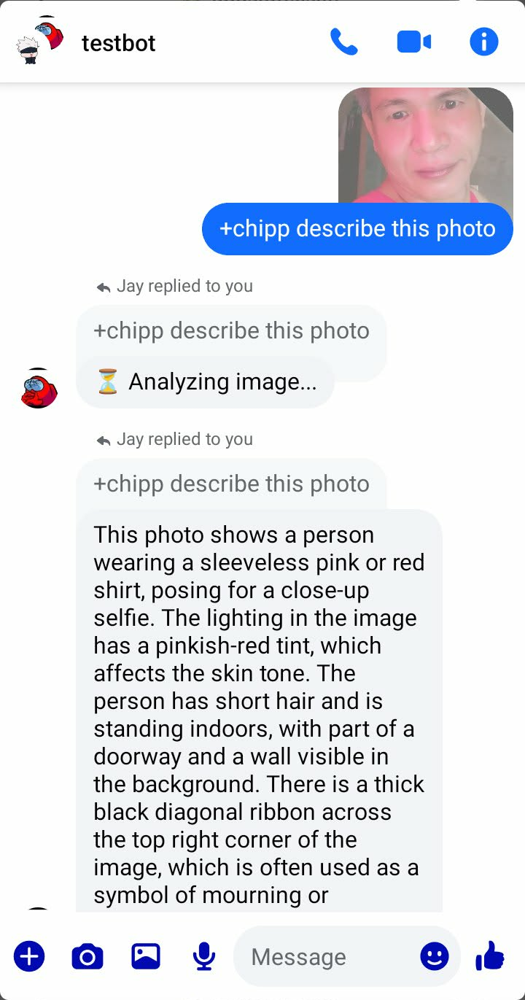
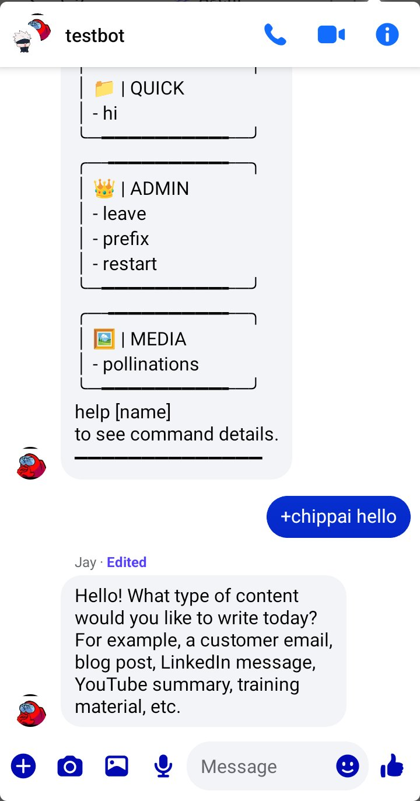
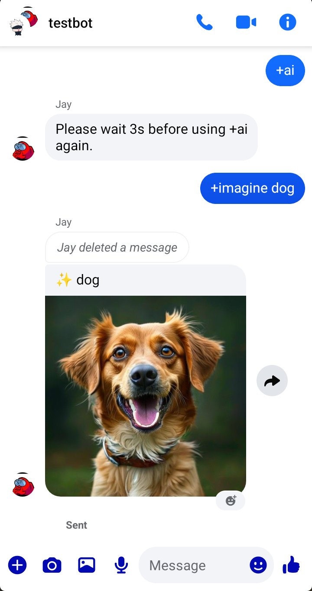

# Xedd Bot — Facebook Messenger Bot

> **⚠️ Beta Notice:** This project is currently in beta. Some features may not work as expected, and errors may occasionally appear. Bugs are being actively identified and fixed. Use it at your own risk, and feel free to report any issues you encounter.
Xedd Bot is a personal Facebook Messenger bot built from scratch. It runs directly on your own Facebook account and responds to commands in any group chat or DM. Every part of it is written and owned by me, so I can extend, modify, or rebuild it however I want. Feel free to fork and modify this project.

---

## Tech Stack


| Layer | Technology |
|---|---|
| Language | JavaScript (Node.js) |
| Runtime | Node.js v22+ |
| Web Framework | Express.js |
| FCA | [ws3-fca](https://www.npmjs.com/package/ws3-fca) |

---

## Setup

**1. Clone or download this project.**

**2. Install dependencies:**
```bash
npm install
```

**3. Get your Facebook appstate.**

Use a browser extension like [c3c-ufc-utility](https://github.com/c3cbot/c3c-ufc-utility) or Cookie Editor to export your Facebook cookies. Paste the JSON array into `appstate.json`.

**4. Configure the bot** in `config.json`:
```json
{
  "prefix": "/",
  "admins": ["your_facebook_uid_here"],
  "botName": "Xedd Bot",
  "threadBlacklist": [],
  "permissionGroups": {
    "moderators": [],
    "vip": []
  }
}
```

**5. Run the bot:**
```bash
node index.js
```

---

## Adding a Command

Create a new `.js` file in `commands/`. The bot auto-loads it on startup:

```js
module.exports = {
  name: "commandname",
  aliases: ["alias1", "alias2"],
  author: "Jaymar",
  category: "utility",
  cooldowns: 5,
  description: "What this command does",
  usage: "/commandname <args>",
  role: 0,
  permissions: null,
  noPrefix: false,
  async onCall(api, event, args) {
    api.sendMessage("Hello!", event.threadID);
  }
};
```

---

## Adding an Event

Create a new `.js` file in `events/`. The bot auto-loads it on startup:

```js
module.exports = {
  name: "EventName",
  async onEvent(api, event, config) {
    // runs on every incoming event
  }
};
```

---

## Screenshots

<table>
  <tr>
    <td align="center"><b>Chipp AI — Photo Description</b></td>
    <td align="center"><b>Help & ChippAI Text</b></td>
    <td align="center"><b>AI Cooldown & Image Generation</b></td>
  </tr>
  <tr>
    <td></td>
    <td></td>
    <td></td>
  </tr>
</table>

---

## Notes

- Your `appstate.json` contains your Facebook session — keep it private and never share it
- Admins bypass all cooldowns and permission checks
- The thread blacklist accepts thread IDs as strings
- The bot uses `selfListen: true` internally so events fire regardless of who performs the action, but it ignores its own chat messages to prevent loops

---

**Author:** Jaymar Xedd

---

## License

This project is licensed under the [MIT License](LICENSE).
